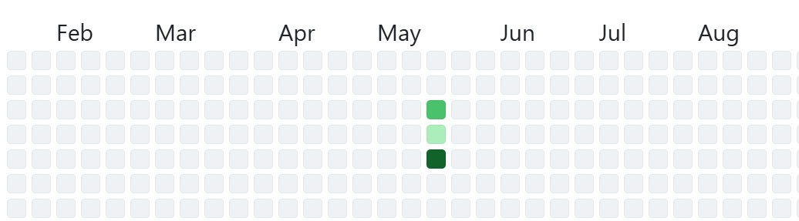

::: {#contrib-figure}
{fig-cap="My GitHub contribution graph"}
:::

  We probably read many blogs saying why blogging is good — monetising your blog, building a personal brand, opening job opportunities, and so on. Those reasons are fine, but in my view, blogging goes beyond all of that. It’s a place where you can simply be you.

Life is getting busier and faster. There isn’t much time to wind down. Most of us are constantly shifting between the roles we play — employee, son, daughter, dad, mum. The days blur together: work, dinner, thinking about what to pack for the kids’ lunch, school drop‑off, weekend sports, family and friends’ catch‑ups. It just keeps going.

In all of that, there’s hardly any time that actually belongs to you.

Some people are really good at journalling — like my daughter. She lights a candle and writes in her diary almost every day. She showed me a few pages once, and they were beautiful. Movie tickets, little notes, tiny things that probably have no monetary value, but through preservation they become meaningful. They look like memories you can hold in your hand.

I’m different. I like being on my computer. I like the ability to backspace, rewrite, and slowly give clarity to my thoughts as I type. Blogging feels like my version of journalling — a digital space where I can pause for a moment and make sense of things.

And I feel like it sparks something. Your imagination wakes up. Your creativity stretches a little. Ideas become clearer.

Even the technical side of it motivates me. When I write a post and push it to my GitHub repo, seeing those little green contribution boxes appear is strangely satisfying. It’s a small visual reminder that I showed up today. One green box at a time — that’s enough to keep me going.

I’m also excited about what I’m feeling now. I’m creating something — something I can point to and say, “I made this.” For once, I’m not just a consumer. I’m a creator, or at least I feel like one.

And that’s really what I want this blog to become: a place where I share what I’m learning, help you build your own GitHub repos, and show how a little bit of R or Python can make life easier, more organised, or just more interesting.
