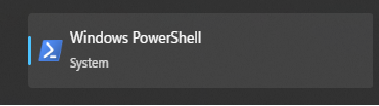
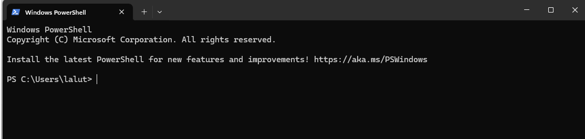

## Why learning a terminal matters
Navigating your computer without the mouse can feel intimidating at first, especially if you’re a visual person like me. But you really can control your computer through a terminal — an application where you type commands and your computer does exactly what you ask. Once you get familiar with the terminal, you’ll find it surprisingly fun and often much faster than clicking around. And some of the tools we’ll use later — like Git — are simply easier to work with through the terminal (don’t worry if you don’t know what Git is yet).  

## Lets open your terminal, I am using Windows, so mine will be PowerShell
Start typing **PowerShell** in your Windows search bar (the area next to the Start button). 

{fig-cap="Search for PowerShell in the Windows search bar"}

You will see Windows PowerShell, click on it to open. You will see your terminal like below.
{fig-cap="Search for PowerShell in the Windows search bar"}
THIS IS STILL IN DRAFT CONTINUING......on 25 May 2026

## Basic commands

### `pwd`

Shows where you are.

### `cd`

Move into a folder.

### `cd ..`

Move back one level.

### `mkdir`

Create a new folder.

### `dir`

List files in the current folder.
